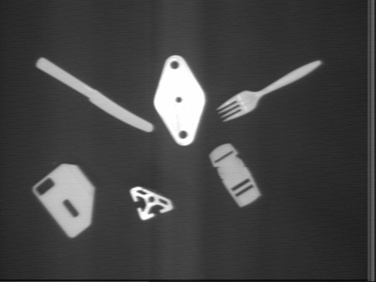
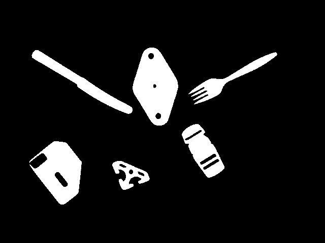
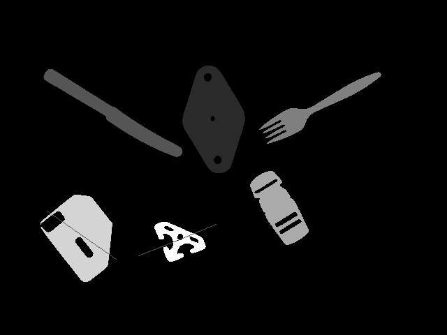

#Info
This project was completed for my Computational Vision class. Using VisionStartCode, my goal was to create a program capable of detecting similar objects in multiple images.

#How to compile
Type 'make all' in this directory. (Currently broken, my bad, ill fix that)

